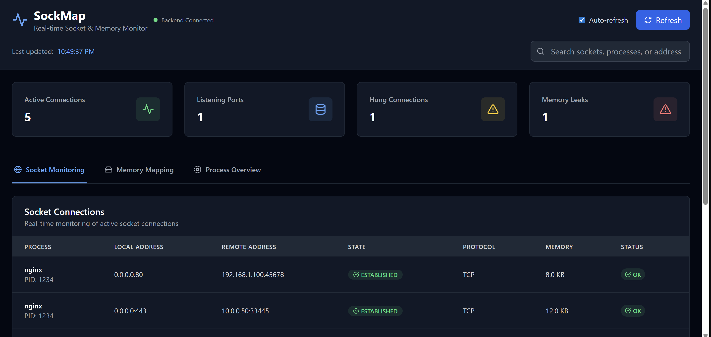
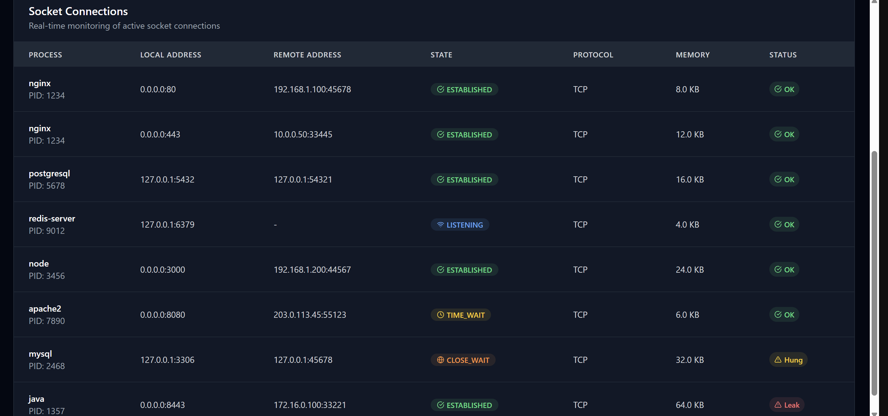
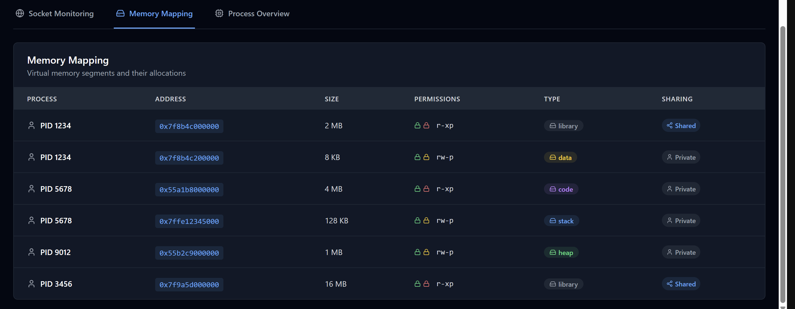
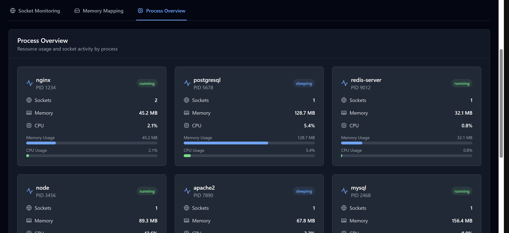

# SockMap v2 - Real-time Socket & Memory Monitoring Dashboard

**SockMap v2** is a full-stack monitoring system for Linux systems. It brings socket connections, memory maps, and process activity into one slick, auto-refreshing, browser-based dashboard. Designed with **efficiency**, **clarity**, and **real-time control** in mind.

Built with **C**, **Python (Flask)**, and a **React + TypeScript** frontend.  
Features include full visibility into socket states, memory leaks, and process behavior.

---

## Core Features

- **Socket Monitoring**: Inspect real-time TCP/UDP connections, including HUNG and LEAKING sockets  
- **Memory Mapping**: See process memory segmentation (heap, stack, code, libraries, etc.)  
- **Process Insight**: CPU/memory consumption + live socket tracking per process  
- **Live Dashboard**: Refreshing UI built with **Vite**, **Tailwind**, and **Lucide**  
- **Cross-language Bridge**: C-powered backend with Python API and React frontend

---

## Architecture Overview

```
┌───────────────┐    ┌──────────────┐    ┌─────────────┐
│ React Frontend│    │  Flask API   │    │   C Binary   │
│  (Port 5173)  │◄──►│ (Port 5000)  │◄──►│   sockmap    │
│   UI Layer    │    │   JSON API   │    │   Scanner    │
└───────────────┘    └──────────────┘    └─────────────┘
```

- Real-time data flows from the **C monitoring binary** → **Python API** → **React dashboard**
- Designed for **low latency**, **modular debugging**, and **developer-first customization**

---

## Quick Start Guide

### 1. Compile the Backend

```bash
cd backend
make clean && make
```

### 2. Launch the API Server

```bash
cd backend/api
pip install -r requirements.txt
python app.py
```

### 3. Start the Frontend

```bash
npm install
npm run dev
```

### 4. View the Dashboard

Head to 👉 `http://localhost:5173`  
Everything updates in real-time. You'll feel like a god.

---

## Backend API Endpoints

| Endpoint               | Description                  |
|------------------------|------------------------------|
| `/api/health`          | API & C binary health check  |
| `/api/trace-sockets`   | Get full system snapshot     |
| `/api/sockets`         | Get all socket info          |
| `/api/memory`          | Memory map (all processes)   |
| `/api/processes`       | Process overview             |

---

## Development Overview

### Backend Structure (C + Python)

```
backend/
├── src/
│   ├── sockmap.c          # Entry point
│   ├── socket_scan.c      # TCP/UDP scanner
│   ├── memory_map.c       # Segment mapping
│   └── process_info.c     # PID stats & summary
├── api/
│   └── app.py             # Flask server
└── Makefile
```

### Frontend Structure (React + Tailwind)

```
frontend/
├── src/
│   ├── Dashboard.tsx      # Main layout
│   ├── SocketList.tsx     # Socket state table
│   ├── MemoryMap.tsx      # Memory segment renderer
│   ├── ProcessInfo.tsx    # Process overview cards
│   └── services/api.ts    # API communication
```

Tech stack:
- **Vite** - lightning fast dev server  
- **TypeScript** - for strict typing  
- **Tailwind CSS** - clean and modern visuals  
- **Lucide Icons** - sexy UI polish

---

## System Requirements

- ✅ Linux OS (for /proc parsing)
- ✅ GCC Compiler (C backend)
- ✅ Python 3.7+ (API)
- ✅ Node.js 16+ (frontend)

---

## Troubleshooting

**No data shown?**  
Make sure:
- C backend is compiled and running
- Flask server is listening on `:5000`
- Frontend can reach the API (CORS issues?)

**Hung or leaked sockets?**  
They'll be shown right on the dashboard, color-coded and flagged. No digging. Just fix it.

**Permission issues?**  
Try running the backend binary with elevated rights:  
```bash
sudo ./sockmap
```

---

## 🤝 Contributing

Wanna make it even better?

1. Fork the repo  
2. Branch off main  
3. Test backend & frontend  
4. Submit your PR 

---


### 📸 Sample Dashboard Screens

<div align="center">
  
</div>

<div align="center">
  
</div>

<div align="center">
  
</div>

<div align="center">
  
</div>
